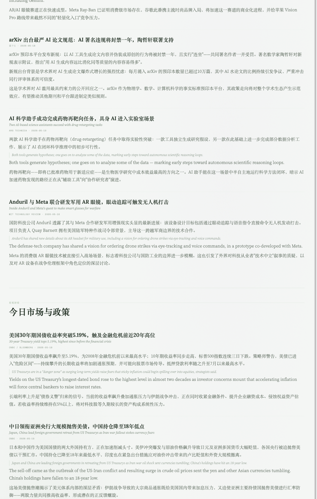

# claude-os

> I stopped reading financial news. My Claude OS does it now — and it's better.



Claude Code is a terminal tool. I treat it as an operating system.

**Kernel** → a 400-line [`CLAUDE.md`](./CLAUDE.md) that shapes how Claude thinks  
**Apps** → [8 production skills](./skills/) for research, intelligence, and dev  
**Philosophy** → every skill has a design doc explaining *why*, not just *what*


---

## What this does for me

| Routine | Skill | Time saved |
|---------|-------|-----------|
| Morning tech + markets digest | `morning-brief` | 90 min/day of reading |
| Investment theme research | `alpha-hunter` | Structures hours of research into 20 min |
| LLM selection | `model-coding-benchmark` | Replaces guesswork with data |
| WeChat article capture | `wechat-article-save` | Zero-friction, just paste the URL |
| Any web search | `super-search` | One interface, 6+ sources, auto-routing |

---

## The Skills

| Skill | What it does | Level |
|-------|-------------|-------|
| [alpha-hunter](./skills/alpha-hunter/) | Technology investment lifecycle analysis | 📐 template |
| [super-search](./skills/super-search/) | Unified search across Serper, Firecrawl, GitHub, and more | 🔧 configure |
| [morning-brief](./skills/morning-brief/) | Daily AI + markets digest → HTML report | 🔧 configure |
| [evening-brief](./skills/evening-brief/) | Evening recap: news, deep dive, knowledge | 🔧 configure |
| [model-coding-benchmark](./skills/model-coding-benchmark/) | Blind LLM coding benchmark with cross-evaluator scoring | 🔧 configure |
| [market-anomaly-monitor](./skills/market-anomaly-monitor/) | Price anomaly detection + event attribution | 🔧 configure |
| [wechat-article-save](./skills/wechat-article-save/) | Auto-saves WeChat articles on URL paste | ⚡ plug-in |

**Install any skill:**
```bash
cp -r skills/SKILL_NAME ~/.claude/skills/
```

---

## The Kernel

Most people use Claude Code like a chatbot.  
I spent 6 months writing a 400-line instruction file.

It defines: response style, when to stop and ask, code review criteria,
skill invocation rules, output format, and a running correction log.

The subagent dispatch logic alone — routing tasks to parallel agents with structured review — has changed how I approach any complex work.

→ [View CLAUDE.md](./CLAUDE.md)

---

## Philosophy

Skills are not prompts. A prompt tells Claude what to do once.  
A skill changes how Claude behaves in a category of situations —  
permanently, composably, without repetition.

The OS metaphor is real: CLAUDE.md is the kernel (always loaded, shapes
everything), skills are the apps (loaded on demand, single responsibility),
and cron hooks are the daemons (run in the background without intervention).

The most important skill in this repo isn't the most complex one.
It's the one that became invisible — I don't think about it anymore,
I just get the output.

---

## Chinese version

→ [中文版 README](./README.zh.md)

---

If this changed how you think about Claude Code, ⭐ star it.
